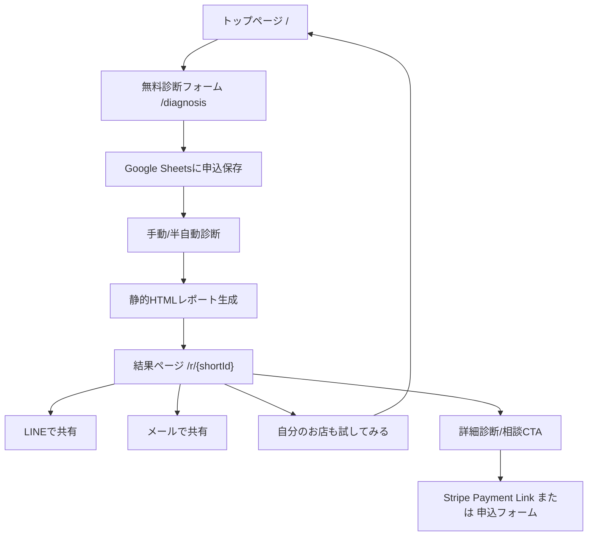

# お客様どっと混む バックヤード仕様 v0.1

作成日: 2026-05-11

## 1. 第一弾の基本方針

第一弾は、完全自動SaaSではなく、**静的HTMLレポート + Google Sheets + 手動/半自動診断**で稼働させる。

目的は、ログインや保存機能を作ることではなく、以下を最短で回すこと。

1. 無料診断を受け付ける
2. 店舗特定を確認する
3. Google Maps診断、簡易SEO診断、独自診断を行う
4. おしゃれに見える静的HTML結果ページを生成する
5. 結果画面でLINE/メール共有できる
6. 共有先が「自分のお店も試してみる」からトップへ戻れる
7. 有料診断/相談へ進める

---

## 2. 確定した技術・運用方針

| 項目 | 方針 | 理由 |
|---|---|---|
| 診断結果ページ | 静的HTML | 見た目を作り込みやすく、初期は編集・保存機能が不要 |
| 申込データ保存 | Google Sheets | β版10店舗なら十分。運用しながら列を増やせる |
| 診断作業画面 | Google Sheets | 管理画面を作らずに運用できる |
| 結果URL | 短いURL `/r/abc123` | LINE共有しやすく、見た目が良い |
| LINE共有 | 定型文付きURL共有 | 共有時に文脈が伝わる |
| メール共有 | `mailto:` | 初期実装が軽い |
| 有料導線 | Stripe連携を後で入れやすい設計 | 初期はPayment Linkでも可。後でCheckout/API連携へ移行 |

---

## 3. 第一弾システム構成



---

## 4. URL設計

| パス | 用途 |
|---|---|
| `/` | トップページ |
| `/diagnosis` | 無料診断フォーム |
| `/r/{shortId}` | 診断結果ページ |
| `/sample-report` | サンプル診断結果 |
| `/thanks` | 申込完了 |
| `/pricing` | 有料メニュー |
| `/privacy` | プライバシーポリシー |
| `/terms` | 利用上の注意 |

### 4.1 shortId

形式:

- 6-8文字
- 英小文字 + 数字
- 例: `/r/nasu24a`, `/r/cafe7k2`

避ける文字:

- `0` と `o`
- `1` と `l`
- 日本語

理由:

- LINEで共有しやすい
- 口頭でも伝えやすい
- 顧客ページ感が出すぎない

---

## 5. Google Sheets設計

### 5.1 シート構成

最低限、以下の4シートに分ける。

| シート名 | 用途 |
|---|---|
| `requests` | 診断申込 |
| `store_identity` | 店舗特定判定 |
| `scores` | スコア入力 |
| `reports` | 結果ページ管理 |

### 5.2 requests

| カラム | 内容 |
|---|---|
| request_id | 申込ID |
| created_at | 申込日時 |
| status | 受付/確認中/診断中/公開済/要確認/キャンセル |
| store_name | 店舗名 |
| area | エリア/住所 |
| category | 業種 |
| google_maps_url | Google Maps URL |
| website_url | 公式サイトURL、なければなし |
| instagram_url | Instagram URL、なければなし |
| youtube_url | 任意 |
| tiktok_url | 任意 |
| x_url | 任意 |
| desired_customer | 来てほしいお客様 |
| current_problem | 今困っていること |
| owner_name | 申込者名 |
| email | メール |
| memo | 内部メモ |

### 5.3 store_identity

| カラム | 内容 |
|---|---|
| request_id | 申込ID |
| identity_status | 一致/要確認/不一致/未判定 |
| matched_store_name | 確認した正式店舗名 |
| matched_address | 確認した住所 |
| matched_phone | 確認した電話 |
| maps_category | Google Mapsカテゴリ |
| website_match | 一致/不一致/未判定 |
| sns_match | 一致/不一致/未判定 |
| identity_notes | 判定メモ |

### 5.4 scores

| カラム | 内容 |
|---|---|
| request_id | 申込ID |
| total_score | 総合えらばれ度 |
| maps_score | Google Maps整備度 |
| review_score | 口コミ信頼 |
| meo_score | MEO来店導線 |
| seo_score | 簡易SEO。未判定可 |
| geo_score | GEO/AI検索対応。未判定可 |
| instagram_score | Instagram世界観。未判定可 |
| sns_video_score | SNS動画導線。未判定可 |
| previsit_anxiety_score | 来店前不安解消 |
| save_score | Save導線 |
| plan_score | Plan導線 |
| impulse_score | Impulse導線 |
| worldview_score | 世界観一致 |
| borrowed_scenery_score | 借景依存度 |
| own_charm_conversion_score | 自店魅力転換度 |
| cx_score | 顧客体験 |
| strongest_axis | 最も強い導線 |
| weakest_axis | 最も弱い導線 |
| top_fix | 今すぐ直すべき1点 |
| video_idea_1 | 今撮るべき動画1 |
| video_idea_2 | 今撮るべき動画2 |
| video_idea_3 | 今撮るべき動画3 |

### 5.5 reports

| カラム | 内容 |
|---|---|
| request_id | 申込ID |
| short_id | URL用ID |
| report_status | 下書き/公開/非公開 |
| report_path | `/r/{shortId}` |
| report_title | レポートタイトル |
| published_at | 公開日時 |
| line_share_text | LINE共有文 |
| email_subject | メール件名 |
| email_body | メール本文 |
| paid_cta_type | 詳細診断/Zoom相談/月額支援 |
| stripe_product_key | 後日Stripe連携用 |

---

## 6. 静的HTMLレポート生成

### 6.1 生成方式

初期は以下のどちらかでよい。

1. テンプレートHTMLを複製して手動で差し替える
2. Google Sheetsの行データから簡易スクリプトでHTMLを生成する

第一弾は 1 でも稼働可能。β版10店舗を超えるなら 2 に移行する。

### 6.2 配置

Vercel上では以下のように配置する。

```text
public/
  r/
    nasu24a/
      index.html
    cafe7k2/
      index.html
```

公開URL:

```text
https://okyakusa-ma.com/r/nasu24a
```

---

## 7. 共有仕様

### 7.1 LINE共有

形式:

```text
https://social-plugins.line.me/lineit/share?url={encodedReportUrl}&text={encodedText}
```

共有文例:

```text
お客様どっと混むで「森の入口カフェ」の見え方診断をしてみました。
Google Maps・口コミ・SNS・来店前不安が点数で見られます。
あなたのお店も無料で試せます。
{reportUrl}
```

### 7.2 メール共有

`mailto:` で実装。

件名:

```text
お店の見え方診断を共有します
```

本文:

```text
お客様どっと混むで診断した結果ページです。

Google Maps、口コミ、SNS、来店前不安などをまとめて確認できます。
あなたのお店も無料で試せるようです。

{reportUrl}
```

---

## 8. 有料導線とStripe準備

### 8.1 第一弾の有料導線

初期は、Stripe APIを本格連携せず、以下のどちらかで始められる。

- Stripe Payment Link
- 有料相談申込フォーム

ただし、後で決済連携しやすいように、Google Sheetsには以下のフィールドを持っておく。

| フィールド | 内容 |
|---|---|
| paid_cta_type | 詳細診断/Zoom相談/月額支援 |
| stripe_product_key | 商品キー |
| payment_status | 未案内/案内済/決済待ち/決済済/キャンセル |
| stripe_customer_id | 後日連携用 |
| stripe_checkout_session_id | 後日連携用 |
| stripe_subscription_id | 後日連携用 |

### 8.2 商品キー案

| 商品キー | 内容 |
|---|---|
| `detail_report_9800` | 詳細診断 9,800円 |
| `detail_report_19800` | 詳細診断 19,800円 |
| `zoom_review_19800` | Zoom解説付き診断 19,800円 |
| `visit_audit_49800` | 店舗訪問診断 49,800円 |
| `monthly_light_9800` | 月次ライト支援 9,800円/月 |
| `monthly_standard_19800` | 月次標準支援 19,800円/月 |

### 8.3 後でStripe連携するときの流れ

1. 顧客が有料CTAを押す
2. `request_id` と `stripe_product_key` を持ってCheckout Sessionを作る
3. 決済完了Webhookを受け取る
4. Google SheetsまたはDBの `payment_status` を決済済に更新
5. 詳細診断フォームまたは予約導線を表示

第一弾ではこの自動処理は作らないが、データ構造だけ先に合わせておく。

---

## 9. 第一弾の作業工程

1. トップページHTMLを本番化
2. 無料診断フォームを作成
3. Google Sheetsを作成
4. Sheetsの列を本仕様に合わせる
5. 診断結果HTMLテンプレートを作成
6. `/r/{shortId}` で公開できるようにする
7. LINE共有/メール共有ボタンを実装
8. 「あなたのお店も試してみませんか？ 完全無料」ボタンを設置
9. 有料CTAを仮設置
10. β版10店舗で運用

---

## 10. 作らないもの

第一弾では以下は作らない。

- ログイン
- 顧客マイページ
- 結果編集画面
- Stripe API本格連携
- 自動メール送信
- Google Maps API連携
- SNS API連携
- 全自動SEO順位取得

---

## 11. 結論

第一弾は、以下の構成で十分稼働可能。

```text
Vercel静的サイト
Google Sheets
静的HTML診断結果
LINE共有
mailto共有
Stripe後日連携を見据えた商品キー
```

この形なら、軽く始められ、見た目も良く、共有による自然な紹介導線も作れる。

---

## 12. 実装状況 v0.1.1

2026-05-11時点で、第一弾の受付導線として以下を実装した。

| 項目 | 状態 | 実装 |
|---|---|---|
| 1. 入力フォーム送信 | 実装済 | `/` のフォームから `/api/diagnosis` へ送信 |
| 2. Google Sheets保存 | 連携コード実装済 | `google-apps-script/diagnosis-intake.gs` をApps Scriptに設置後、Vercel環境変数で接続 |
| 3. 受付完了画面 | 実装済 | `/thanks/?id={request_id}` |
| 4. 手作業で診断 | 運用設計済 | Google Sheetsの `requests` 行を見て診断 |
| 5. 静的HTML結果ページ作成 | サンプル実装済 | `/r/sample/` を複製して `/r/{shortId}/` を作る |
| 6. `/r/xxxx` で公開 | サンプル実装済 | `/r/sample/` |
| 7. LINE・メール共有 | 実装済 | 結果ページ下部で現在URLを共有 |

### 12.1 Google Sheets連携の設定手順

1. Google Sheetsを新規作成する
2. 拡張機能 → Apps Script を開く
3. `google-apps-script/diagnosis-intake.gs` の内容を貼り付ける
4. `EXPECTED_SECRET` を任意の長い文字列に変更する
5. デプロイ → 新しいデプロイ → 種類「ウェブアプリ」
6. 実行ユーザーは自分、アクセスできるユーザーは「全員」
7. 発行されたウェブアプリURLをコピーする
8. VercelのProject Settings → Environment Variablesに以下を追加する

| 変数名 | 値 |
|---|---|
| `GOOGLE_SCRIPT_URL` | Apps ScriptのウェブアプリURL |
| `GOOGLE_SCRIPT_SECRET` | `EXPECTED_SECRET` と同じ文字列 |

追加後、Vercelで再デプロイすると、フォーム送信がGoogle Sheetsの `requests` シートへ保存される。

### 12.2 結果ページ作成の運用

1. `requests` シートで申込を確認する
2. 店舗特定、Google Maps、SEO/SNS、来店前不安を確認する
3. `/r/sample/index.html` を複製して `/r/{shortId}/index.html` を作る
4. 店舗名、スコア、強み、弱点、動画案、共有文を差し替える
5. GitHubへpushするとVercelで公開される

この段階では完全自動生成ではなく、β版10店舗を回すための手動/半自動運用とする。
