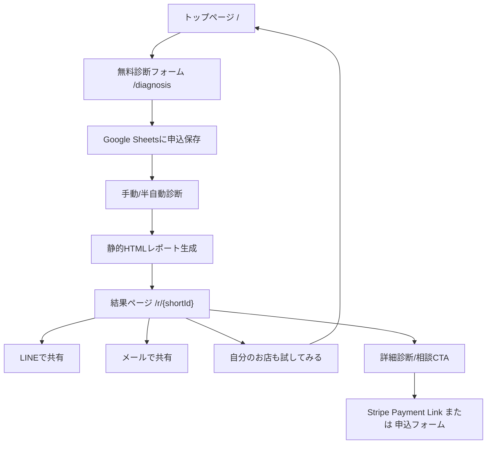

# お客様どっと混む バックヤード仕様 v0.1

作成日: 2026-05-11

## 1. 第一弾の基本方針

第一弾は、完全自動SaaSではなく、**静的HTMLレポート + Google Sheets + 手動/半自動診断**で稼働させる。

目的は、ログインや保存機能を作ることではなく、以下を最短で回すこと。

1. 無料診断を受け付ける
2. 店舗特定を確認する
3. Google Maps診断、簡易SEO診断、独自診断を行う
4. おしゃれに見える静的HTML結果ページを生成する
5. 結果画面でLINE/メール共有できる
6. 共有先が「自分のお店も試してみる」からトップへ戻れる
7. 有料診断/相談へ進める

---

## 2. 確定した技術・運用方針

| 項目 | 方針 | 理由 |
|---|---|---|
| 診断結果ページ | 静的HTML | 見た目を作り込みやすく、初期は編集・保存機能が不要 |
| 申込データ保存 | Google Sheets | β版10店舗なら十分。運用しながら列を増やせる |
| 診断作業画面 | Google Sheets | 管理画面を作らずに運用できる |
| 結果URL | 短いURL `/r/abc123` | LINE共有しやすく、見た目が良い |
| LINE共有 | 定型文付きURL共有 | 共有時に文脈が伝わる |
| メール共有 | `mailto:` | 初期実装が軽い |
| 有料導線 | Stripe連携を後で入れやすい設計 | 初期はPayment Linkでも可。後でCheckout/API連携へ移行 |

---

## 3. 第一弾システム構成



---

## 4. URL設計

| パス | 用途 |
|---|---|
| `/` | トップページ |
| `/diagnosis` | 無料診断フォーム |
| `/r/{shortId}` | 診断結果ページ |
| `/sample-report` | サンプル診断結果 |
| `/thanks` | 申込完了 |
| `/pricing` | 有料メニュー |
| `/privacy` | プライバシーポリシー |
| `/terms` | 利用上の注意 |

### 4.1 shortId

形式:

- 6-8文字
- 英小文字 + 数字
- 例: `/r/nasu24a`, `/r/cafe7k2`

避ける文字:

- `0` と `o`
- `1` と `l`
- 日本語

理由:

- LINEで共有しやすい
- 口頭でも伝えやすい
- 顧客ページ感が出すぎない

---

## 5. Google Sheets設計

### 5.1 シート構成

最低限、以下の4シートに分ける。

| シート名 | 用途 |
|---|---|
| `requests` | 診断申込 |
| `store_identity` | 店舗特定判定 |
| `scores` | スコア入力 |
| `reports` | 結果ページ管理 |

### 5.2 requests

| カラム | 内容 |
|---|---|
| request_id | 申込ID |
| created_at | 申込日時 |
| status | 受付/確認中/診断中/公開済/要確認/キャンセル |
| store_name | 店舗名 |
| area | エリア/住所 |
| category | 業種 |
| google_maps_url | Google Maps URL |
| website_url | 公式サイトURL、なければなし |
| instagram_url | Instagram URL、なければなし |
| youtube_url | 任意 |
| tiktok_url | 任意 |
| x_url | 任意 |
| desired_customer | 来てほしいお客様 |
| current_problem | 今困っていること |
| owner_name | 申込者名 |
| email | メール |
| memo | 内部メモ |

### 5.3 store_identity

| カラム | 内容 |
|---|---|
| request_id | 申込ID |
| identity_status | 一致/要確認/不一致/未判定 |
| matched_store_name | 確認した正式店舗名 |
| matched_address | 確認した住所 |
| matched_phone | 確認した電話 |
| maps_category | Google Mapsカテゴリ |
| website_match | 一致/不一致/未判定 |
| sns_match | 一致/不一致/未判定 |
| identity_notes | 判定メモ |

### 5.4 scores

| カラム | 内容 |
|---|---|
| request_id | 申込ID |
| total_score | 総合えらばれ度 |
| maps_score | Google Maps整備度 |
| review_score | 口コミ信頼 |
| meo_score | MEO来店導線 |
| seo_score | 簡易SEO。未判定可 |
| geo_score | GEO/AI検索対応。未判定可 |
| instagram_score | Instagram世界観。未判定可 |
| sns_video_score | SNS動画導線。未判定可 |
| previsit_anxiety_score | 来店前不安解消 |
| save_score | Save導線 |
| plan_score | Plan導線 |
| impulse_score | Impulse導線 |
| worldview_score | 世界観一致 |
| borrowed_scenery_score | 借景依存度 |
| own_charm_conversion_score | 自店魅力転換度 |
| cx_score | 顧客体験 |
| strongest_axis | 最も強い導線 |
| weakest_axis | 最も弱い導線 |
| top_fix | 今すぐ直すべき1点 |
| video_idea_1 | 今撮るべき動画1 |
| video_idea_2 | 今撮るべき動画2 |
| video_idea_3 | 今撮るべき動画3 |

### 5.5 reports

| カラム | 内容 |
|---|---|
| request_id | 申込ID |
| short_id | URL用ID |
| report_status | 下書き/公開/非公開 |
| report_path | `/r/{shortId}` |
| report_title | レポートタイトル |
| published_at | 公開日時 |
| line_share_text | LINE共有文 |
| email_subject | メール件名 |
| email_body | メール本文 |
| paid_cta_type | 詳細診断/Zoom相談/月額支援 |
| stripe_product_key | 後日Stripe連携用 |

---

## 6. 静的HTMLレポート生成

### 6.1 生成方式

初期は以下のどちらかでよい。

1. テンプレートHTMLを複製して手動で差し替える
2. Google Sheetsの行データから簡易スクリプトでHTMLを生成する

第一弾は 1 でも稼働可能。β版10店舗を超えるなら 2 に移行する。

### 6.2 配置

Vercel上では以下のように配置する。

```text
public/
  r/
    nasu24a/
      index.html
    cafe7k2/
      index.html
```

公開URL:

```text
https://okyakusa-ma.com/r/nasu24a
```

---

## 7. 共有仕様

### 7.1 LINE共有

形式:

```text
https://social-plugins.line.me/lineit/share?url={encodedReportUrl}&text={encodedText}
```

共有文例:

```text
お客様どっと混むで「森の入口カフェ」の見え方診断をしてみました。
Google Maps・口コミ・SNS・来店前不安が点数で見られます。
あなたのお店も無料で試せます。
{reportUrl}
```

### 7.2 メール共有

`mailto:` で実装。

件名:

```text
お店の見え方診断を共有します
```

本文:

```text
お客様どっと混むで診断した結果ページです。

Google Maps、口コミ、SNS、来店前不安などをまとめて確認できます。
あなたのお店も無料で試せるようです。

{reportUrl}
```

---

## 8. 有料導線とStripe準備

### 8.1 第一弾の有料導線

初期は、Stripe APIを本格連携せず、以下のどちらかで始められる。

- Stripe Payment Link
- 有料相談申込フォーム

ただし、後で決済連携しやすいように、Google Sheetsには以下のフィールドを持っておく。

| フィールド | 内容 |
|---|---|
| paid_cta_type | 詳細診断/Zoom相談/月額支援 |
| stripe_product_key | 商品キー |
| payment_status | 未案内/案内済/決済待ち/決済済/キャンセル |
| stripe_customer_id | 後日連携用 |
| stripe_checkout_session_id | 後日連携用 |
| stripe_subscription_id | 後日連携用 |

### 8.2 商品キー案

| 商品キー | 内容 |
|---|---|
| `detail_report_9800` | 詳細診断 9,800円 |
| `detail_report_19800` | 詳細診断 19,800円 |
| `zoom_review_19800` | Zoom解説付き診断 19,800円 |
| `visit_audit_49800` | 店舗訪問診断 49,800円 |
| `monthly_light_9800` | 月次ライト支援 9,800円/月 |
| `monthly_standard_19800` | 月次標準支援 19,800円/月 |

### 8.3 後でStripe連携するときの流れ

1. 顧客が有料CTAを押す
2. `request_id` と `stripe_product_key` を持ってCheckout Sessionを作る
3. 決済完了Webhookを受け取る
4. Google SheetsまたはDBの `payment_status` を決済済に更新
5. 詳細診断フォームまたは予約導線を表示

第一弾ではこの自動処理は作らないが、データ構造だけ先に合わせておく。

---

## 9. 第一弾の作業工程

1. トップページHTMLを本番化
2. 無料診断フォームを作成
3. Google Sheetsを作成
4. Sheetsの列を本仕様に合わせる
5. 診断結果HTMLテンプレートを作成
6. `/r/{shortId}` で公開できるようにする
7. LINE共有/メール共有ボタンを実装
8. 「あなたのお店も試してみませんか？ 完全無料」ボタンを設置
9. 有料CTAを仮設置
10. β版10店舗で運用

---

## 10. 作らないもの

第一弾では以下は作らない。

- ログイン
- 顧客マイページ
- 結果編集画面
- Stripe API本格連携
- 自動メール送信
- Google Maps API連携
- SNS API連携
- 全自動SEO順位取得

---

## 11. 結論

第一弾は、以下の構成で十分稼働可能。

```text
Vercel静的サイト
Google Sheets
静的HTML診断結果
LINE共有
mailto共有
Stripe後日連携を見据えた商品キー
```

この形なら、軽く始められ、見た目も良く、共有による自然な紹介導線も作れる。

---

## 12. 実装状況 v0.1.1

2026-05-11時点で、第一弾の受付導線として以下を実装した。

| 項目 | 状態 | 実装 |
|---|---|---|
| 1. 入力フォーム送信 | 実装済 | `/` のフォームから `/api/diagnosis` へ送信 |
| 2. Google Sheets保存 | 連携コード実装済 | `google-apps-script/diagnosis-intake.gs` をApps Scriptに設置後、Vercel環境変数で接続 |
| 3. 受付完了画面 | 実装済 | `/thanks/?id={request_id}` |
| 4. 手作業で診断 | 運用設計済 | Google Sheetsの `requests` 行を見て診断 |
| 5. 静的HTML結果ページ作成 | サンプル実装済 | `/r/sample/` を複製して `/r/{shortId}/` を作る |
| 6. `/r/xxxx` で公開 | サンプル実装済 | `/r/sample/` |
| 7. LINE・メール共有 | 実装済 | 結果ページ下部で現在URLを共有 |

### 12.1 Google Sheets連携の設定手順

1. Google Sheetsを新規作成する
2. 拡張機能 → Apps Script を開く
3. `google-apps-script/diagnosis-intake.gs` の内容を貼り付ける
4. `EXPECTED_SECRET` を任意の長い文字列に変更する
5. デプロイ → 新しいデプロイ → 種類「ウェブアプリ」
6. 実行ユーザーは自分、アクセスできるユーザーは「全員」
7. 発行されたウェブアプリURLをコピーする
8. VercelのProject Settings → Environment Variablesに以下を追加する

| 変数名 | 値 |
|---|---|
| `GOOGLE_SCRIPT_URL` | Apps ScriptのウェブアプリURL |
| `GOOGLE_SCRIPT_SECRET` | `EXPECTED_SECRET` と同じ文字列 |

追加後、Vercelで再デプロイすると、フォーム送信がGoogle Sheetsの `requests` シートへ保存される。

### 12.2 結果ページ作成の運用

1. `requests` シートで申込を確認する
2. 店舗特定、Google Maps、SEO/SNS、来店前不安を確認する
3. `data/reports/{shortId}.json` を作り、店舗名、スコア、強み、弱点、動画案を入力する
4. `node scripts/generate-report.js data/reports/{shortId}.json` を実行する
5. `/r/{shortId}/index.html` が生成される
6. GitHubへpushするとVercelで公開される

テスト用に `data/reports/test-store.json` と `/r/test01/` を用意済み。

この段階では完全自動生成ではなく、β版10店舗を回すための手動/半自動運用とする。

---

## 13. 3AI初期フィードバック項目

Grok、Gemini、ChatGPTからの初期レビューを、今後の改善課題として保持する。

### 13.1 共通評価

- Vercel + Google Sheets + Apps Script + GitHub + 静的HTMLレポートの軽量MVP構成は、那須・栃木β10店舗運用に適している
- 最初からログイン、DB、Stripe、SNS API、Google Maps API、本格SaaS管理画面を作らなかった判断は正しい
- `/r/{shortId}/` の個別結果ページとLINE/メール共有導線は、β運用と紹介導線の核になる
- 「観測値」と「独自スコア」を分けた設計は重要な独自性になる
- 本当の勝負は機能数ではなく、店舗オーナーが「これは自分の店のことだ」と感じる診断レポートの質である

### 13.2 優先課題

1. フォーム入力項目の最小化
   - 必須項目は、店舗名、エリア、業種、申込者名、メール、困りごと程度に絞る
   - Google Maps URL、公式サイト、Instagram、その他SNSは任意または後続入力にする
   - 初回離脱を下げることを最優先する

2. 診断レポート文体の改善
   - 単なる指摘ではなく、「選ばれる状態への翻訳」にする
   - 例: 「Instagram投稿頻度が低い」ではなく「行ってみたいは生まれているが、今週行こうに変わる情報が少ない」
   - 毎回「この店の話」になっていることを重視し、思想の一般論化を避ける

3. レポートサンプル3パターン作成
   - 飲食店
   - カフェ
   - 美容室/整体などの非飲食店舗
   - それぞれで、弱点トップ3、今すぐ直す1点、今撮るべき動画3本の具体性を検証する

4. β運用記録シートの追加
   - 診断前の状態
   - 店主の第一反応
   - 「当たっている」と感じた項目
   - 実行した改善
   - 2週間後/1ヶ月後の変化
   - 有料診断/月額支援への関心

5. Before / After記録
   - Google Maps整備、口コミ返信、Instagram導線、Save/Plan/Impulseの変化を追う
   - 将来の成果グラフ、事例記事、SaaS版の元データにする

6. 結果URLの推測困難化
   - 本番では `/r/test01/` のような連番・テストIDを使わない
   - `nasu7k2a` のような英小文字+数字のランダムIDにする
   - 診断結果ページは、共有前提ではあるが第三者に推測されにくくする

7. 店舗オーナーへの説明スクリプト作成
   - 診断結果を見せる順番
   - 点数は絶対評価ではなく改善目安であること
   - 「今すぐ直す1点」から始めること
   - 改善前後の変化を追ってよいかの許諾

### 13.3 中期課題

- β10店舗終了後、Next.js + Supabase等への移行を検討する
- Stripe決済は、診断レポートの価値検証後に導入する
- LLMを使った診断文生成、GEOシミュレーション、レポート生成自動化を段階的に試す
- SNS共有用の「1枚診断カード」を検討する
- 那須10店舗の観測記録を、将来の独自データ資産として蓄積する

---

## 14. 将来的なAPI拡張マップ

「お客様どっと混む」は、無料診断MVPから有料版・月額版へ段階的に拡張する。将来的には以下をすべて実装候補とする。

### 14.1 全体ロードマップ

| 領域 | 目的 | 主な機能 | 有料価値 |
|---|---|---|---|
| Google Places API / Maps診断 | 店舗特定とMEO観測値の精度向上 | Place ID、正式店舗名、住所、カテゴリ、営業時間、評価、口コミ件数、写真、周辺競合候補 | 店舗を間違えない診断、Maps整備度、競合比較 |
| Gemini API診断JSON | 観測値を診断モデルへ変換 | Save/Plan/Impulse、来店前不安、世界観、借景、自店魅力転換の仮説生成 | 人間の診断作業を半自動化、レポート文体の安定化 |
| Search Console API | 自社サイトのSEO実測値取得 | 検索クエリ、表示回数、クリック数、CTR、平均掲載順位 | 「実際に拾えている/逃している検索語」の可視化 |
| YouTube Data API | 公開動画の診断 | タイトル、説明欄、投稿日、サムネイル、再生数、投稿頻度 | Shorts/YouTube導線の改善提案 |
| YouTube Analytics API | 所有チャンネルの内部分析 | 視聴維持、流入元、視聴時間、エンゲージメント | 動画が来店導線として機能しているかの分析 |
| Google Ads Keyword Planner | 地域キーワード需要の把握 | 地域名+ランチ/グルメ/美容室/整体等の検索需要、関連語 | 狙うべきSEO/MEO/GEOキーワードの優先順位化 |
| Gemini Search / Maps Grounding | AI検索・地域文脈の補強 | AIが推薦しやすい情報、外部Web上の見え方、地域文脈 | GEO/AI検索対応スコアの高度化 |
| Supabase等DB | 顧客・診断・月次履歴の永続化 | 顧客、店舗、診断履歴、Before/After、課金状態 | 本格SaaS化の基盤 |
| Stripe | 有料診断・月額課金 | Payment Link、Checkout、Subscription、Webhook | 有料版・月額版への移行 |
| PDF/共有カード | オーナー共有と営業資料化 | PDF出力、SNS共有用1枚カード、月次レポート | 店主・スタッフ・紹介先への共有価値 |

### 14.2 精度向上の目安

API連携により、以下のような精度・説得力向上を見込む。

| 診断領域 | 現MVP | API連携後の目安 | 主な理由 |
|---|---:|---:|---|
| 店舗特定 | 70〜80% | 90〜95% | Place ID、住所、カテゴリ、電話等で照合できる |
| Google Maps/MEO診断 | 50〜60% | 80〜90% | 評価、口コミ件数、営業時間、カテゴリ、写真等を観測値化できる |
| SEO診断 | 40〜60% | 80〜90% | Search Consoleで実クエリ、CTR、平均掲載順位を取得できる |
| YouTube/SNS動画診断 | 40〜60% | 65〜90% | 公開情報+所有者Analyticsで動画導線を可視化できる |
| キーワード調査 | 40〜50% | 75〜85% | Keyword Plannerで地域需要を確認できる |
| GEO/AI検索診断 | 30〜50% | 70〜85% | Gemini groundingでWeb/Maps文脈を補強できる |

ただし、世界観・空気感・来店前不安・借景依存は完全自動化せず、以下の流れを基本とする。

```text
APIで観測値を取る
↓
Geminiで仮説を出す
↓
人間が最終判断する
↓
レポート文体で「選ばれる状態」へ翻訳する
```

### 14.3 有料版の位置づけ

無料版は「見え方の入口診断」、有料版は「実データ連携による改善ダッシュボード」として分ける。

| プラン | 内容 | 価格仮説 |
|---|---|---:|
| 無料診断 | フォーム入力、簡易スコア、サンプルレポート | 0円 |
| 有料βライト | Google Maps実データ診断、Gemini診断JSON、月次レポート、今月直す1点、今月撮る動画3本 | 9,800〜19,800円/月 |
| 標準 | Search Console連携、競合比較、月次Zoom解説、Before/After記録 | 29,800〜49,800円/月 |
| 上位 | 店舗訪問、SNS動画運用、Google Maps改善、口コミ返信支援、Web改善 | 79,800円/月〜 |

### 14.4 今週中に狙う短期スプリント

今週中に実装を狙う候補は、以下の3点に絞る。

```text
Google Places API
+
Gemini診断JSON
+
月次レポートβ
```

#### 目的

- 店舗特定の精度を上げる
- Google Maps/MEOの観測値を自動取得する
- Geminiで診断JSONの下書きを作る
- 月次有料版の最小価値をテストできる状態にする

#### 実装範囲 v0.2候補

1. Google Places API連携
   - 店舗名+エリアから候補取得
   - Place ID保存
   - 正式店舗名、住所、カテゴリ、評価、口コミ件数、営業時間を取得
   - `store_identity` シートへ保存

2. Gemini診断JSON生成
   - 入力情報 + Places観測値 + 手動メモをもとに診断JSONを生成
   - 出力項目: 総合スコア、Maps整備、口コミ信頼、来店前不安、Save/Plan/Impulse、強み3つ、弱点3つ、今すぐ直す1点、今撮る動画3本
   - 人間が確認・修正してからレポート化

3. 月次レポートβ
   - `monthly_reports` シートを追加
   - 今月の観測値、改善提案、実行状況、次月アクションを記録
   - `/r/{shortId}/monthly/{yyyymm}/` または既存結果ページ内の月次セクションとして公開

#### 今週中に作らないもの

- OAuthログイン
- Search Console連携
- YouTube Analytics連携
- Google Ads API / Keyword Planner
- Stripe Subscription本格連携
- 顧客別マイページ

この短期スプリントが通れば、月額9,800〜19,800円の有料βの検証に入れる可能性がある。

### 14.5 v0.2 実装状況

2026-05-12時点で、以下を実装した。

| 機能 | 状態 | 実装 |
|---|---|---|
| Google Places API観測 | 実装済 | `/api/places` |
| Gemini診断JSON | 実装済 | `/api/gemini-diagnosis` |
| 月次レポートβJSON | 実装済 | `/api/monthly-report` |
| フォーム受付時の自動拡張 | 実装済 | `AUTO_ENRICH_DIAGNOSIS=true` のとき `/api/diagnosis` で自動実行 |
| Google Sheets保存先 | 実装済 | `maps_observations`、`ai_diagnoses`、`monthly_reports`、`api_errors` |
| APIキー未設定時のフォールバック | 実装済 | 既存受付は壊さず、未設定メッセージと簡易診断JSONを返す |

#### 追加したVercel環境変数

| 変数名 | 必須 | 内容 |
|---|---|---|
| `GOOGLE_PLACES_API_KEY` | Places連携で必須 | Google Places API (New) を有効にしたAPIキー |
| `GEMINI_API_KEY` | Gemini連携で必須 | Google AI Studio / Gemini APIキー |
| `GEMINI_MODEL` | 任意 | 既定値は `gemini-2.5-flash` |
| `AUTO_ENRICH_DIAGNOSIS` | 任意 | `true` にすると無料診断受付時にPlaces、Gemini、月次βを自動生成 |
| `BETA_API_SECRET` | 任意 | 設定すると `/api/places` 等の直接呼び出しに `x-beta-api-secret` が必要 |
| `GOOGLE_PLACES_DETAIL_LEVEL` | 任意 | `extended` にするとMaps詳細項目（駐車場、支払い、価格帯、サービス属性、要約、口コミサンプル等）も取得 |

既存の以下は引き続き必要。

| 変数名 | 内容 |
|---|---|
| `GOOGLE_SCRIPT_URL` | Apps ScriptのウェブアプリURL |
| `GOOGLE_SCRIPT_SECRET` | Apps Script側 `EXPECTED_SECRET` と同じ秘密文字列 |

#### APIの役割

`/api/places`

- 店舗名、エリア、業種からGoogle Places APIで候補を取得
- Place ID、正式店名、住所、カテゴリ、評価、口コミ件数、営業時間、電話、Webサイト、写真数を観測
- 店舗特定ステータス `一致/要確認/未判定` とMaps改善項目を返す

`/api/gemini-diagnosis`

- 入力情報とPlaces観測値からGemini診断JSONを生成
- 総合スコア、Maps、口コミ、SEO/GEO、来店前不安、Save/Plan/Impulse、強み、弱点、今すぐ直す1点、今撮る動画3本を返す
- APIキー未設定時はルールベースの簡易フォールバックを返す

`/api/monthly-report`

- Places観測値とGemini診断JSONから月次レポートβの下書きを作る
- 今月の観測値、スコアスナップショット、今月の重点改善、アクション、動画計画、次回確認質問を返す

#### Google Sheets追加シート

Apps Scriptを再デプロイすると、以下のシートが追加される。

| シート名 | 用途 |
|---|---|
| `maps_observations` | Google Places / Maps観測値 |
| `ai_diagnoses` | Gemini診断JSON |
| `monthly_reports` | 月次レポートβ |
| `api_errors` | 自動拡張時のAPIエラー記録 |

#### 運用上の注意

- Google Places APIは利用量に応じて課金されるため、βでは対象店舗だけで使う
- `GOOGLE_PLACES_DETAIL_LEVEL=extended` は取得項目が増え、課金SKUが上がる可能性があるため、無料診断常時ONではなくワンコイン診断/検証時に使う
- `AUTO_ENRICH_DIAGNOSIS=true` は便利だが、公開フォーム送信ごとにAPIが動くため、運用開始時は慎重に有効化する
- 直接APIを試す場合は、必要に応じて `BETA_API_SECRET` を設定して濫用を防ぐ
- Geminiの診断JSONは下書きであり、最終レポートは人間が確認・修正してから公開する

### 14.6 診断結果ビュー v0.2.1

2026-05-12時点で、Google Sheetsに保存された診断結果をWebで確認する簡易ビューを追加した。

| 機能 | 状態 | 実装 |
|---|---|---|
| 受付IDから結果取得 | 実装済 | `/api/report?id={request_id}` |
| Sheets側の結果結合 | 実装済 | Apps Script `doGet?action=report` |
| 診断下書き表示画面 | 実装済 | `/r/view/?id={request_id}` |
| 受付完了画面からの遷移 | 実装済 | `/thanks/?id={request_id}` に「診断下書きを確認する」を表示 |

#### 表示する主な内容

- 総合スコア
- Google Maps観測値
- 口コミ件数・評価
- SEO/GEOスコア
- 強みトップ3
- 弱点トップ3
- 今すぐ直すべき1点
- 今撮るべき動画3本
- 月次レポートβの重点改善・アクション
- LINE共有、メール共有、「あなたのお店も試してみませんか？」導線

#### 運用上の注意

- `/r/view/?id={request_id}` はSheets上の下書きをそのまま表示するため、βでは「診断下書き」として扱う
- 本格公開レポートにする場合は、人間が内容確認後に静的HTML `/r/{shortId}/` を生成する
- Apps Script側も更新・再デプロイしないと、Vercel側の `/api/report` は古いApps Scriptを見に行ってしまう
